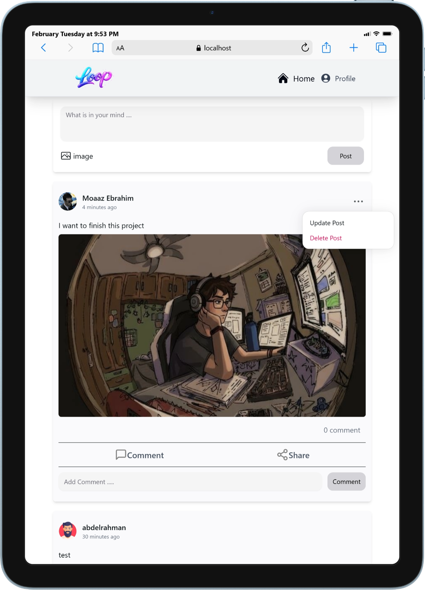
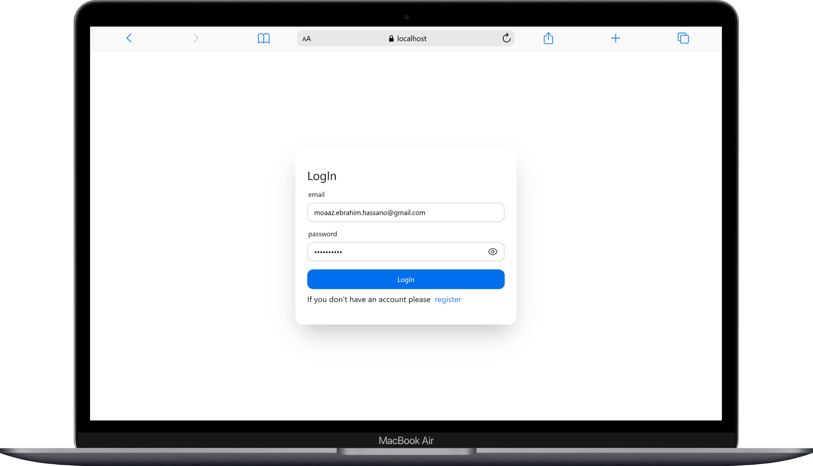

# LOOP – Social Media Front-End (React)

A modern social media front-end application built with React, featuring
authentication, protected routes, infinite scrolling, and real-time UI updates.

##  Key Features

- Authentication & Authorization
- Protected Routes & Layout-based Routing
- Infinite Scroll (Facebook-like experience)
- CRUD Operations for Posts & Comments
- React Query for Server State Management
- Responsive UI with Tailwind CSS

##  Tech Stack

- React 19
- React Router v6
- React Query (TanStack)
- Axios
- Tailwind CSS
- Hero UI
- React Hook Form + Zod


##  Project Folder Structure

```
src
├── assets
│
├── Components
│   ├── postComponents
│   │   ├── CreatePostCard.jsx
│   │   ├── CreatePostComment.jsx
│   │   └── PostForm.jsx
│   │
│   ├── CommentLoadingScrean.jsx
│   ├── NavBar.jsx
│   ├── OpenScreen.jsx
│   └── PostLoadingScrean.jsx
│
├── Context
│   └── AuthenticationContext.jsx
│
├── Layouts
│   ├── AuthenticationLayout.jsx
│   ├── MainLayout.jsx
│   └── SettingsLayout.jsx
│
├── Pages
│   ├── ChangePasswordPage.jsx
│   ├── HomePage.jsx
│   ├── LoginPage.jsx
│   ├── LogOutPage.jsx
│   ├── NotFoundPage.jsx
│   ├── PostDetailsPage.jsx
│   ├── ProfilePage.jsx
│   └── RegisterPage.jsx
│
├── ProtectedRoute
│   ├── AuthenticationProtectedRoute.jsx
│   └── ProtectedRoute.jsx
│
├── schemaValidation
│   ├── ChangePasswordValidation.js
│   ├── loginValidation.js
│   └── registerValidation.js
│
├── Services
│   ├── CommentServices.js
│   ├── loginServices.js
│   ├── postServices.js
│   ├── sendRegisterData.js
│   ├── sharePost.js
│   ├── timeFormat.js
│   └── userprofile.js
│
├── App.jsx
├── hero.js
├── index.css
└── main.jsx
```

---


## Routing & Protected
- MainLayout
    - SettingsLayout
- AuthenticationLayout

- ProtectedRoute
- AuthenticationProtectedRoute
---


# Project Features

## 1. Authentication
The application provides a secure authentication system. Users can:

- Create a new account (**Sign Up**).
- Log in securely (**Sign In**).
- Change their password after logging in.
- Upload or update their profile photo.
- Access their own profile data once authenticated.

Authentication is handled using **token-based authorization**, shared across the app using **Context API**.

---

## 2. Posts Management
Users can manage content within the application:

- Create new posts.
- View posts in a feed with **infinite scrolling**.
- View all their own posts in their profile.
- Open a post to see its full details.
- Update or delete their own posts.

### Infinite Scrolling
- Posts are loaded in pages (chunks) for better performance.
- Scrolling down automatically loads more content without reloading the page.
- Provides a smooth, social-media-like experience.

---

## 3. Comments Management
Users can interact with posts through comments:

- Add comments to posts.
- View all comments for a specific post.
- Edit their own comments.
- Delete their own comments.

Comments are dynamically fetched and updated in real-time after any create, update, or delete operation.


## Live Demo
<a href="https://react-social-media-app-beta.vercel.app/" target="_blank">🌐 Live Demo</a>


## Screenshots

### Mobile Views
  
  
  
  

### Tablet Views
  

### Desktop / Laptop Views
  
  


