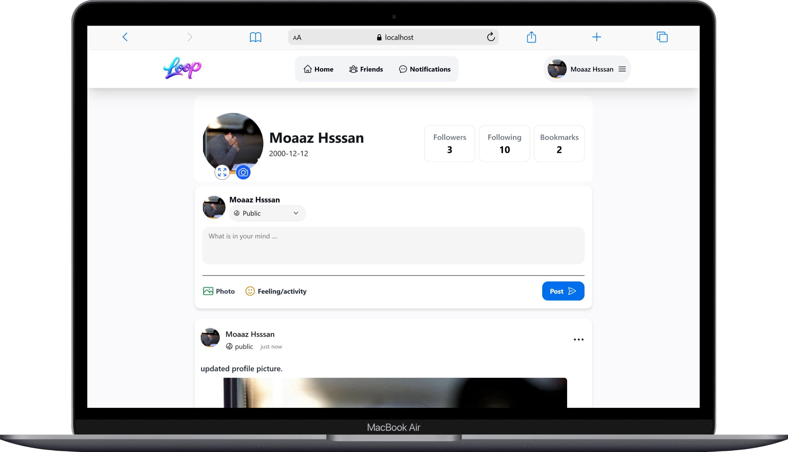
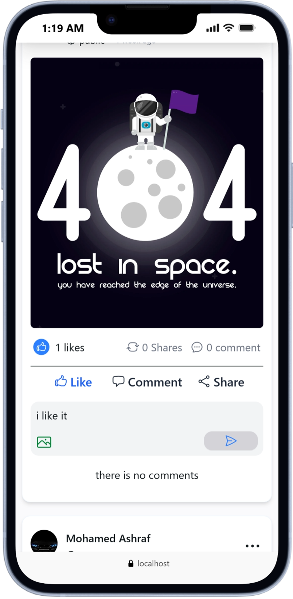

# LOOP – Social Media Front-End (React)

A modern and scalable social media front-end application built with React.  
The app provides a full social experience including authentication, posts, comments, follow system, notifications, and real-time UI updates.

---

##  Features

###  Authentication & Authorization
- Secure Sign Up & Sign In system
- Token-based authentication
- Change password functionality
- Protected routes using custom guards
- Global auth state using Context API

---

###  Posts Management
- Create, edit,save and unSave, and delete posts
- View posts in a dynamic feed
- Infinite scrolling (pagination-based)
- View post details page
- View user's own posts

---

###  Comments System
- Add comments to posts
- Edit and delete comments
- Real-time UI updates after actions
- Efficient fetching using React Query

---

###  Post Interactions
- Like / Unlike posts
- Share posts
- Save posts (Bookmark system)
- Dedicated page for saved posts

---

###  Follow System
- Follow / Unfollow users
- View followers list
- View following list
- Suggested friends system
- Dynamic updates without refresh

---

###  Notifications System
- Real-time notifications for:
  - New followers
  - Likes on posts
  - Comments on posts
  - and more
- Mark notification as read
- Mark all as read
- Unread notifications indicator

---

##  Project Folder Structure

```
src
├── assets
│
├── Components
│
├── Context
│
├── Layouts
│
├── Pages
│
├── ProtectedRoute
│
├── schemaValidation
│
├── Services
│
├── App.jsx
├── hero.js
├── index.css
└── main.jsx
```

---

## Tech Stack

### Front-End
- React 19
- React DOM

### Routing
- React Router DOM v7

### State Management & Data Fetching
- React Query (TanStack Query v5)

### Forms & Validation
- React Hook Form
- Zod
- @hookform/resolvers

### UI & Styling
- Tailwind CSS v4
- Hero UI
- Framer Motion (animations)

### API & Networking
- Axios

### UX Enhancements
- React Intersection Observer (for infinite scroll)
- Emoji Picker React

---


## Live Demo
<a href="https://react-social-media-app-beta.vercel.app/" target="_blank">🌐 Live Demo</a>

## 📸 Screenshots

  
  
  
  
  
  

---


